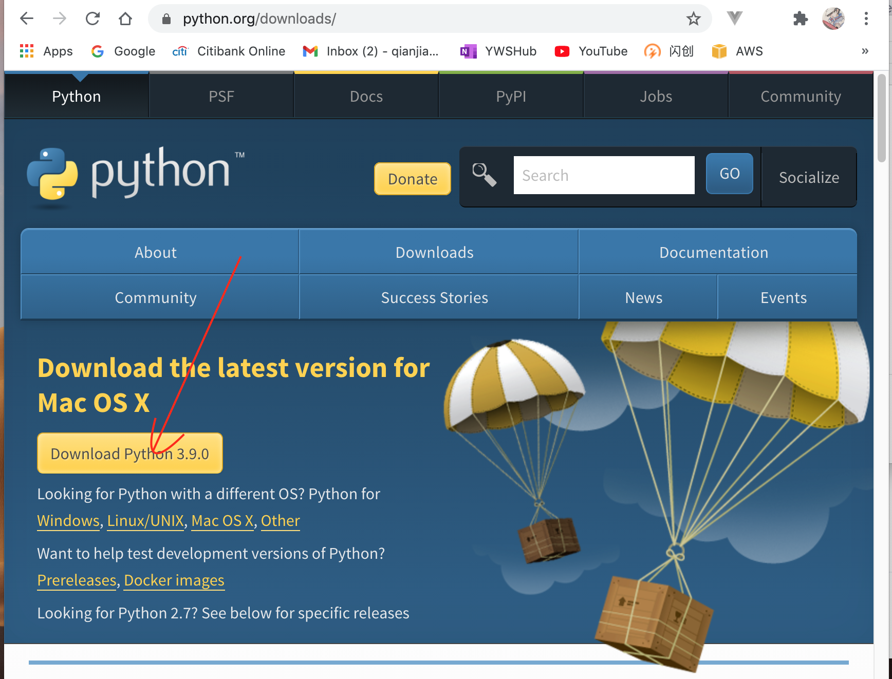
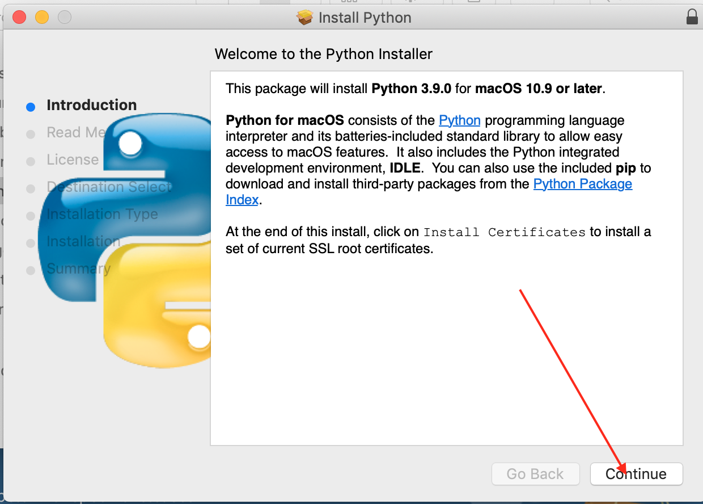

# Python Class Software Installation

## Table of Contents
- [Python Class Software Installation](#python-class-software-installation)
  - [Table of Contents](#table-of-contents)
  - [Install VSCode](#install-vscode)
  - [Install Python](#install-python)
  - [Install Git](#install-git)
  - [PIP install missing module](#pip-install-missing-module)
  - [Image utility (ImageMagick)](#image-utility-imagemagick)


## Install VSCode
VSCode is the python program editor we will use in our class.
* 下载 VSCode

>Google search: vscode download
Search result: Download Visual Studio Code - Mac, Linux, Windows

[VSCode Download Website](https://code.visualstudio.com/Download)


> File: VSCode-darwin-stable.zip
* Extract zip file to ~/Downloads folder, 

    - MacOS: move "Visual Studio Code" to Application folder
    - Windows 10: 

* Check the success of the installation

double click the desktop icon, start VSCode.

* Install extentions
    * Python; for Running, Debugging, IntelliSense 
    * Markdown All in One; Markdown preview, Table of contents, Math Equation
    * Markdown Preview from Matt Bierner; better preview
  ```mermaid
  sequenceDiagram
    participant Alice
    participant Bob
    Alice->>John: Hello John, how are you?
    loop Healthcheck
      John->>John: Fight against hypochondria
    end
    Note right of John: Rational thoughts<br/>trivial...
    John-->>Alice: Great!
    John->>Bob: How about you?
    Bob-->>John: Jolly good!
  ```
  [Mermaid Diagram](https://mermaid-js.github.io/mermaid/#/)
    * Markdown to PDF; convert markdown to PDF
    * Pylance; source code format
    * Unicode Latex; Insert unicode 
      Command Palette... > Unicode: Insert Math Symble > 𝛑r²
      7 ÷ 5 = 1.4, 3
    * vscode-pdf; PDF preview
    * PlantUML; generate diagram from code
    * Jupyter; Python Notebook
  
* Setup Virture Environment
```Windows
python -m venv env
./env/bin/activate.bat
```

```mac
python -m venv env
source env/bin/activate
```
    - close terminal, open new terminal
    - Command Pallete ... > Python Select Interpreter

---
[Table of Contents](#table-of-contents)

## Install Python
We need Python interpretor installed in order to execute Python program.

* 下载 Python

>Google search: python download

Search result: Download Python | Python.org

[Python Download Website](https://www.python.org/downloads/)



File: 

python-3.9.0-macosx10.9.pkg (MacOS)

python-3.9.0-amd64.exe (Windows OS)

* Install python

double click the downloaded file, 


* Check the installation

```
python --version
```

* Setup Python interpreter in VS Code
```DOS
python -m venv env
./env/bin/activate.bat
```

```MACOS
python3 -m venv env
source env/bin/activate
```

Command Palette...>Python: Select Interpreter

---
[Table of Contents](#table-of-contents)

## Install Git
Git is very powerful source version control software nowaday, we will use it for our python source code version control and homework repository.

* Download Git

>Google search: git downloads
Search result: Git - Downloads 

[Git Download website](https://git-scm.com/downloads)


File: Git-2.29.2-64-bit.exe

* install Git

double click the executable file.

* Use brew to install git on MacOS

```
brew install git
ls -la /usr/local 
sudo chown -R wangqianjiang:wheel /usr/local
brew link git
```

Some version of MACOS, you just check the git version, it will install git when there is no git installed.

* Check the installation

```
git --version
```
---
[Table of Contents](#table-of-contents)

## PIP install missing module

```
c:/Users/12818/workspace/django/hello.py
Traceback (most recent call last):
  File "c:\Users\12818\workspace\django\hello.py", line 1, in <module>
    import pandas as pd
ModuleNotFoundError: No module named 'pandas'
```
Whenever you see ModuleNotFoundError: do the following

```
pip install pandas
```

check all modules that pip installed
```
pip freeze
```

## Image utility (ImageMagick)
* Installation file: ImageMagick-x86_64-pc-windows.exe

* installed at C:\Program Files (x86)\ImageMagick-7.0.11-Q8

```
magick

```

* Conver images from png to gif, list of png file to one gif file
```
magick F_*.png motion.gif
magick pencil.png favicon.ico
```