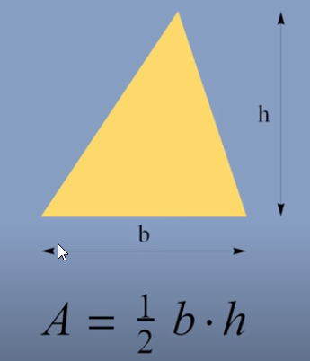

* Write python program define a function named triangle_area(b,h) which calculate a triangle area based on given base and height. The following is the formula of triangle area.

<div>
    <center></center>
</div>

for given code below:

```py
b = 10
h = 20
area = triangleArea(b,h)
```

Expected result:

The trianger area with base=10 and height=20 is 100.0.