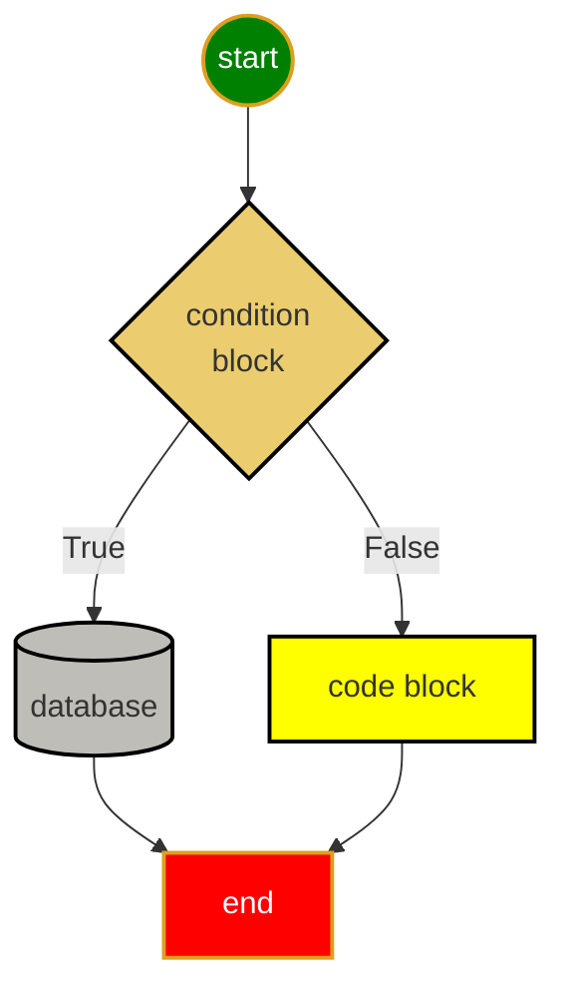

## Useful Icons

⚡️📄📝✔️❌❓❗️📌🔨💡☝️👉👇☝️👍👎👌💾🗑🐛📒⚠️😄😢♻️🔥🛠📐🎯✉️☎️

## Sample File Structure:

```output
<project root>
    ├── 📝doc/
    |    ├── mistakes.md 
    |    ├── vscodeTrics.md 
    |    └── python.md 
    ├── 🔨homeworks/
    |       └── <filenameXX.md>
    ├── 🔥src/
    |      └── hello.py 
    └── 👉ReadMe.md
```

## Sample Mermaid Diagram

