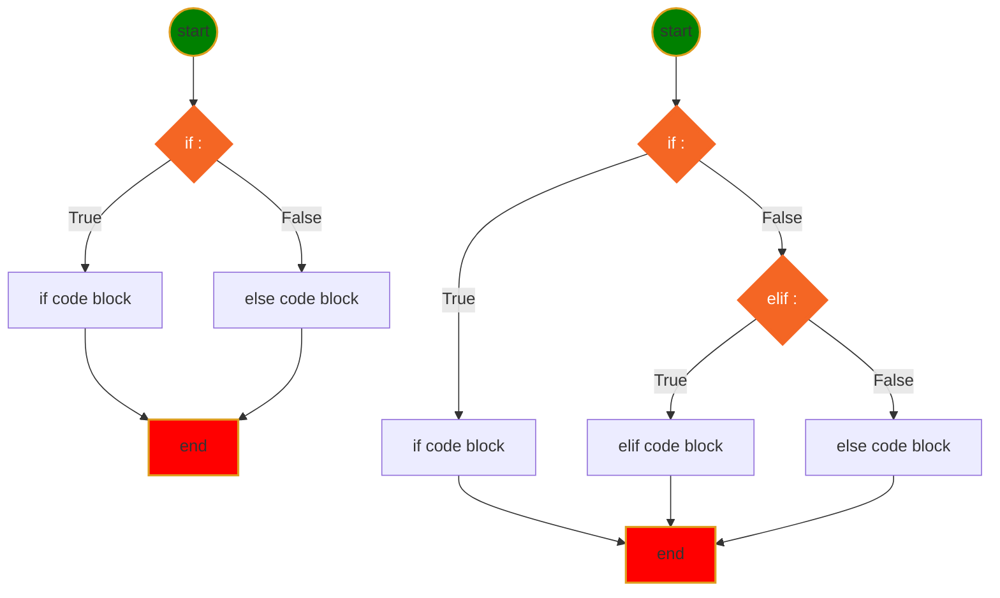
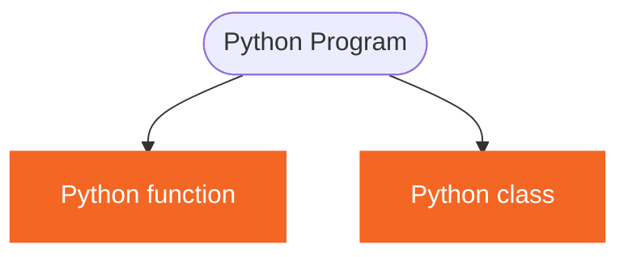
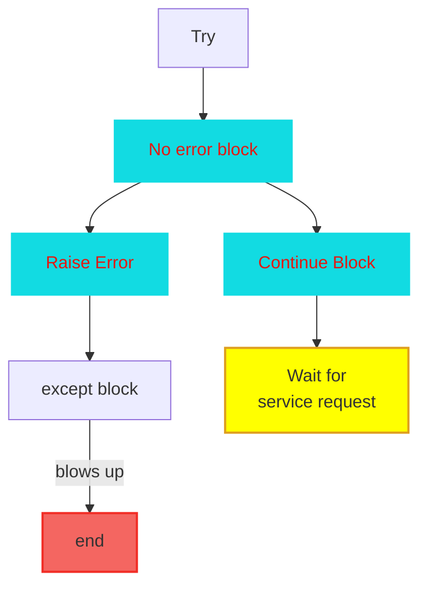

<h1> Python Language Basic </h1>

[Interesting Icons](myIcons.md)

- [My First python program](#my-first-python-program)
- [print(with variable)](#printwith-variable)
- [comment (single line, multiple line)](#comment-single-line-multiple-line)
- [Variable Naming](#variable-naming)
- [Data Type](#data-type)
- [Operator](#operator)
- [Execution Control](#execution-control)
- [Loop](#loop)
- [function](#function)
- [Unit test](#unit-test)


## My First python program
[hello.py](../src/hello.py)

## print(with variable)
[print.py](../src/print.py)
```py
print(f"The circle area with radius={r} is {a:.2f}")
```

## comment (single line, multiple line)
[comment.py](../src/languageBasics/comment.py)
* single line comment
* multiple line comment

## Variable Naming
1. variable name cannot start with number
2. variable can be combination of letters and numbers _, a~z, A~Z, 0~9, no other special characters
3. don't use reserved keywords as variable name

[Python Keywords](https://realpython.com/python-keywords/#:~:text=%20Python%20Keywords%20and%20Their%20Usage%20%201,are%20used%20for%20control%20flow%3A%20if%2C...%20More%20)
4. Avoid using existing function name as your variable name.
otherwise, your python builtins functions no longer works the way you expected.


## Data Type
* [Numbers](../src/languageBasics/number.py)
    - int
    - float
    - complex
* [String](../src/languageBasics/string.py)
    - iterale
    - slicing
    - +, *, <, > operators
    - built in functions (isdigit, isalnum, title, ...)
* [Tuple](../src/languageBasics/tuple.py)
    - iterable
    - immutable
    - slicing
    - +, * operator
* [List](../src/languageBasics/list.py)
    - iterable
    - mutable
    - slicing
    - +, * operator
    - built in functions (append, insert, remove, pop, ...)
* [Set](../src/languageBasics/set.py)
    - iterable
    - mutable
    - built in functions(add, )

* [Dict](../src/languageBasics/dictionary.py)
    - iterable: only iterate key


## Operator 
* [operator](../src/languageBasics/operator.py)
* [arithmatic](../src/languageBasics/operator/arithmatic.py)
* [assignment](../src/languageBasics/operator/assignment.py)
* [comparison](../src/languageBasics/operator/comparison.py)
* [identity](../src/languageBasics/operator/identity.py)
* [logical](../src/languageBasics/operator/logical.py)
* [membership](../src/languageBasics/operator/membership.py)
* [others](../src/languageBasics/operator/others.py)
* [ternary](../src/languageBasics/operator/ternary.py)
* [bitwise](../src/languageBasics/operator/bitwise.py)

## Execution Control
* **if-elif-else** statement Syntax
```py
if <condition>:
    # if code block here
elif <condition>:
    # elif code block here
else:
    #else code block here
# code continue ...
```
* Mermaid Diagram for if-else statement

* [if-else1.py](../src/../content/if-else/if-else1.py)
## Loop
* [simple for loop](../src/languageBasics/loop/for1.py)
* [simple while loop](../src/languageBasics/loop/while.py)
  - a while loop 


## function
    - def, Python reserved keyword
    - function name, anything you want, but need follow the naming rules
    - (), must have open/close parenthesis pair, no matter it has arguments or not
    - arguments, positional or keyword arguments separated by comma ,
    - :, must end with colon
    - the function body must indent
    - ❗️⚡️function can be overridden
    - 😄return more than one value
    - 💡single response
    - call a function by function name and (), and arguments if there is any

-  Other function uses
    - can have functions in functions 
      - [Function In Function](../src/function/functionInFunction.py)
    - passing function to function means that we can create many different functions first with the same amount of values taken in, then use their property to calculate specific values for the target function 
      - [pass function as argument](../src/function/passFunction2function.py)
    - return function can be used to return a function such as the quadratic function, and can be used to calculate specific values when plugged into these equations 
      - [return Function from function](../src/function/returnFunction.py)
$$
\underbrace {def}_{keyword} \underbrace {circle \_area}_{function \space name} \left(\underbrace {a, b,c ...}_{positional\; args} * \underbrace {e=None, f=200}_{keyword\;args}\right) \underbrace {:}_{eol}
$$

[]()
❓What is OOP? What are differences between Functional Programming and OOP
✔️4 Features of OOP
  1. Abstraction:class is a abstraction of object in real world to python program object type.（实体模拟）
  2. Inheritance: a class can inherit from multiple other class to increase code reusability.（共性继承）
  3. Polymorphism:same function behavior differently by different object type.（异类同功）
  4. Encapsulation：avoid data or function being called outside the class unintentionally（自我保护)
* [raiseError.py](../src/function/raiseError.py)




## Unit test
* configure unit test:
    Right-Click ⟹ Command Palette... ⟹ Configure Tests ⟹ unittest ⟹ test ⟹ test_*.py
    
