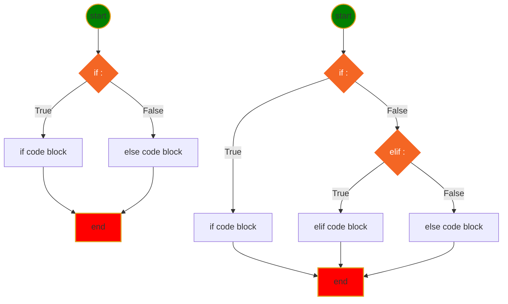

<h1> Python Language Basic </h1>

[Interesting Icons](myIcons.md)

- [My First python program](#my-first-python-program)
- [print(with variable)](#printwith-variable)
- [comment (single line, multiple line)](#comment-single-line-multiple-line)
- [Variable Naming](#variable-naming)
- [Data Type](#data-type)
- [Operator](#operator)
- [Execution Control](#execution-control)
- [Loop](#loop)
- [function](#function)


## My First python program
[hello.py](../src/hello.py)

## print(with variable)
[print.py](../src/print.py)
```py
print(f"The circle area with radius={r} is {a:.2f}")
```

## comment (single line, multiple line)
[comment.py](../src/languageBasics/comment.py)
* single line comment
* multiple line comment

## Variable Naming
1. variable name cannot start with number
2. variable can be combination of letters and numbers _, a~z, A~Z, 0~9, no other special characters
3. don't use reserved keywords as variable name

[Python Keywords](https://realpython.com/python-keywords/#:~:text=%20Python%20Keywords%20and%20Their%20Usage%20%201,are%20used%20for%20control%20flow%3A%20if%2C...%20More%20)
4. Avoid using existing function name as your variable name.
otherwise, your python builtins functions no longer works the way you expected.


## Data Type
* [Numbers](../src/languageBasics/number.py)
    - int
    - float
    - complex
* [String](../src/languageBasics/string.py)
    - iterale
    - slicing
    - +, * operators
    - built in functions (isdigit, isalnum, title, ...)
* [Tuple](../src/languageBasics/tuple.py)
    - iterable
    - immutable
    - slicing
    - +, * operator
* [List](../src/languageBasics/list.py)
    - iterable
    - mutable
    - slicing
    - +, * operator
    - built in functions (append, insert, remove, pop, ...)
* [Set](../src/languageBasics/set.py)
    - iterable
    - mutable
    - built in functions(add, )

* [Dict](../src/languageBasics/dictionary.py)
    - iterable: only iterate key


## Operator 


## Execution Control
* **if-elif-else** statement Syntax
```py
if <condition>:
    # if code block here
elif <condition>:
    # elif code block here
else:
    #else code block here
# code continue ...
```
* Mermaid Diagram for if-else statement

## Loop
[simple for loop](../src/languageBasics/loop/for1.py)


## function
$$
\underbrace {def}_{keyword} \underbrace {circle \_area}_{function \space name} \left(\underbrace {a, b,c ...}_{positional\; args} * \underbrace {e=None, f=200}_{keyword\;args}\right) \underbrace {:}_{eol}
$$

[Function Basics](../src/function/function.py)
⚡️never override built-in functions and your previous defined function if you still need them.


