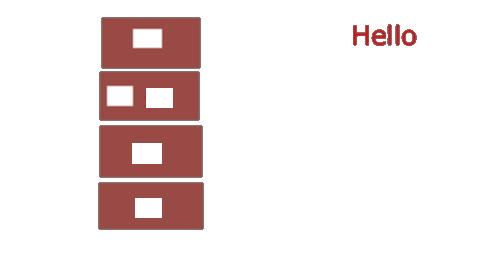
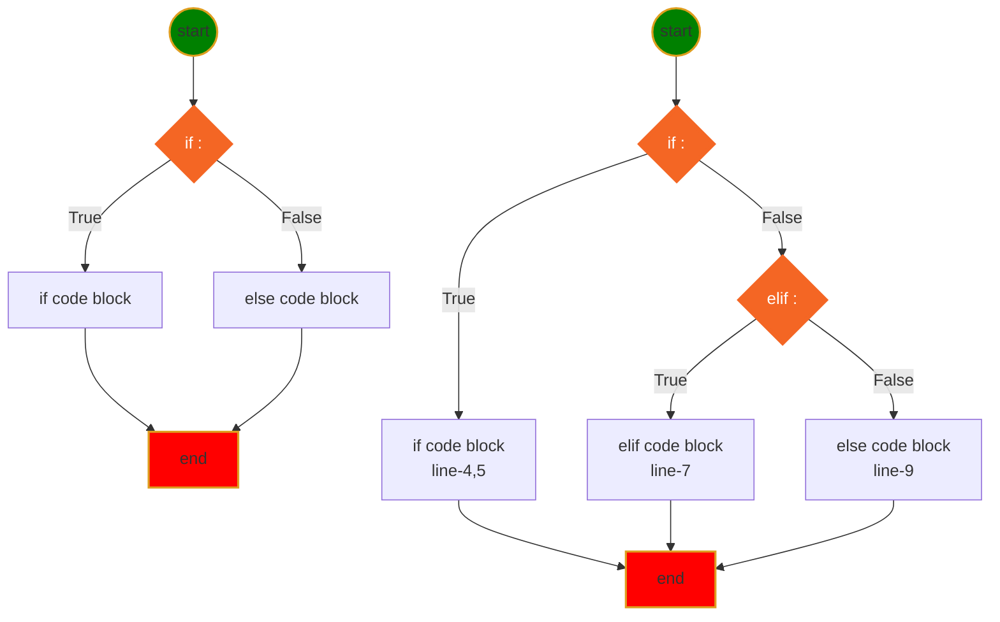
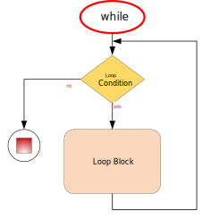
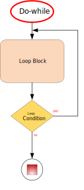

<h1> Python Language Basic </h1>

[Interesting Icons](myIcons.md)

- [My First python program](#my-first-python-program)
- [print(with variable)](#printwith-variable)
- [comment (single line, multiple line)](#comment-single-line-multiple-line)
- [Variable Naming](#variable-naming)
- [Data Type](#data-type)
- [Operator](#operator)
- [Execution Control](#execution-control)
- [Loop](#loop)
- [function](#function)


## My First python program
[hello.py](../src/hello.py)

## print(with variable)
[print.py](../src/print.py)
```py
print(f"The circle area with radius={r} is {a:.2f}")
```

## comment (single line, multiple line)
[comment.py](../src/languageBasics/comment.py)
* single line comment
* multiple line comment

## Variable Naming
1. variable name cannot start with number
2. variable can be combination of letters and numbers _, a~z, A~Z, 0~9, no other special characters
3. don't use reserved keywords as variable name

[Python Keywords](https://realpython.com/python-keywords/#:~:text=%20Python%20Keywords%20and%20Their%20Usage%20%201,are%20used%20for%20control%20flow%3A%20if%2C...%20More%20)
4. Avoid using existing function name as your variable name.
otherwise, your python builtins functions no longer works the way you expected.




## Data Type
* [Numbers](../src/languageBasics/number.py)
    - int
    - float
    - complex
* [String](../src/languageBasics/string.py)
    - iterale
    - slicing
    - +, * operators
    - built in functions (isdigit, isalnum, title, ...)
* [Tuple](../src/languageBasics/tuple.py)
    - iterable
    - immutable
    - slicing
    - +, * operator
* [List](../src/languageBasics/list.py)
    - iterable
    - mutable
    - slicing
    - +, * operator
    - built in functions (append, insert, remove, pop, ...)
* [Set](../src/languageBasics/set.py)
    - iterable
    - mutable
    - &, |, ... operator
    - built in functions(add, )

* [Dict](../src/languageBasics/dictionary.py)
    - iterable: only iterate key
    - built in functions (items, keys,pop)


## Operator 
* [operator](../src/languageBasics/operator.py)
* [arithmatic](../src/languageBasics/operator/arithmatic.py)
* [assignment](../src/languageBasics/operator/assignment.py)
* [comparison](../src/languageBasics/operator/comparison.py)
* [identity](../src/languageBasics/operator/identity.py)
* [logical](../src/languageBasics/operator/logical.py)
* [membership](../src/languageBasics/operator/membership.py)
* [others](../src/languageBasics/operator/others.py)
* [ternary](../src/languageBasics/operator/ternary.py)
* [bitwise](../src/languageBasics/operator/bitwise.py)
* 
* Arithmatic Operator: +; -; *; /: %; **;//(floor divisor)
    [arithmatic.py](../src/arithmatic.py)
* Assignment Operators: =; +=; -=; *=; /=; %=; **=; //=
    [assignment.py](../src/assignment.py)
* Comparison Operators: ==, !=, <, >, <=, >=
    [comparison.py](../src/comparison.py)
* Logical Operator: and, or, not
    [logical.py](../src/logical.py)
* Membership Operator: in, not in
    [membership.py](../src/membership.py)
* Identity Operator: is, is not
    [identity.py](../src/identity.py)
* Ternary operator: if-else, and-or
    [ternary.py](../src/ternary.py)
* Multiple times operator: **
    [others.py](../src/others.py)
* Bitwise Operator: &, |, ^, <<, >>
    [bitwise.py](../src/bitwise.py)


## Execution Control
* **if-elif-else** statement Syntax
```py
if <condition>:
    # if code block here
elif <condition>:
    # elif code block here
else:
    #else code block here
# code continue ...
```
* Mermaid Diagram for if-else statement

* [if-else2.py](../src/../content/if-else/if-else1.py)

## Loop
* For loop
  

* [for/while loop](../src/languageBasics/loop/for2.py)

* While loop
    

[while loop](../src/languageBasics/loop/while.py)
* Python does NOT support do-while loop, but you can simulate do-while.
    
```
while loop has 3 part:
1. initialize variable, a=0
2. variable condition, a<10
3. adjust variable, a +=1
```

[simple for loop](../src/languageBasics/loop/for1.py)


## function
    - def, Python reserved keyword
    - function name, anything you want, but need follow the naming rules
    - (), must have open/close parenthesis pair, no matter it has arguments or not
    - arguments, positional or keyword arguments separated by comma ,
    - :, must end with colon
    - the function body must indent
    - ❗️⚡️function can be overridden
    - 😄return more than one value
    - 💡single response
    - call a function by function name and (), and arguments if there is any

$$
\underbrace {def}_{keyword} \underbrace {circle \_area}_{function \space name} \left(\underbrace {a, b,c ...}_{positional\; args} * \underbrace {e=None, f=200}_{keyword\;args}\right) \underbrace {:}_{eol}
$$

* [Function Basics](../src/function/function.py)
⚡️never override built-in functions and your previous defined function if you still need them.
* [Function in function](../src/function/functionInFunction.py)
* [Return function from function](../src/function/returnFunction.py)
* [pass function as argument](../src/function/passFunction2function.py)
❓What is OOP? What are differences between Functional Programming and OOP
✔️4 Features of OOP
  1. Abstraction:class is a abstraction of object in real world to python program object type.（实体模拟）
  2. Inheritance: a class can inherit from multiple other class to increase code reusability.（共性继承）
  3. Polymorphism:same function behavior differently by different object type.（异类同功）
  4. Encapsulation：avoid data or function being called outside the class unintentionally（自我保护)
