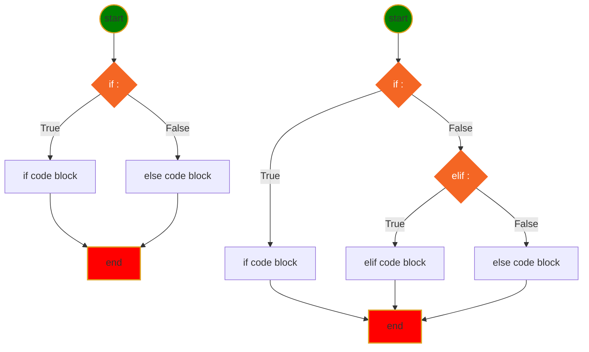
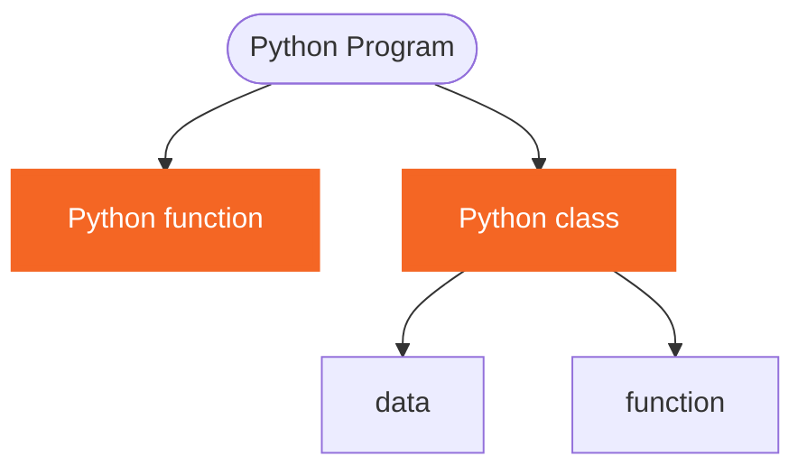
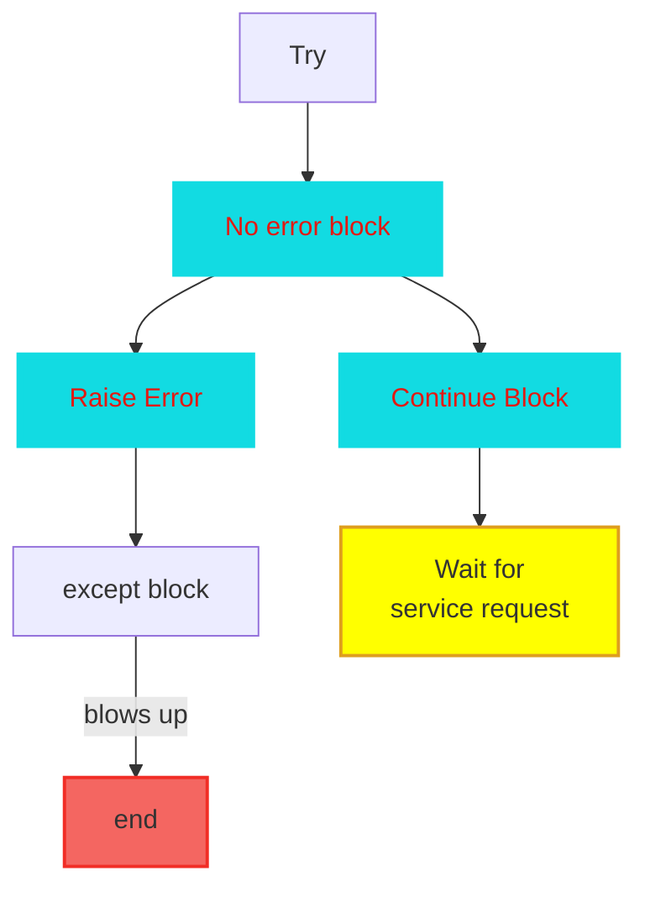
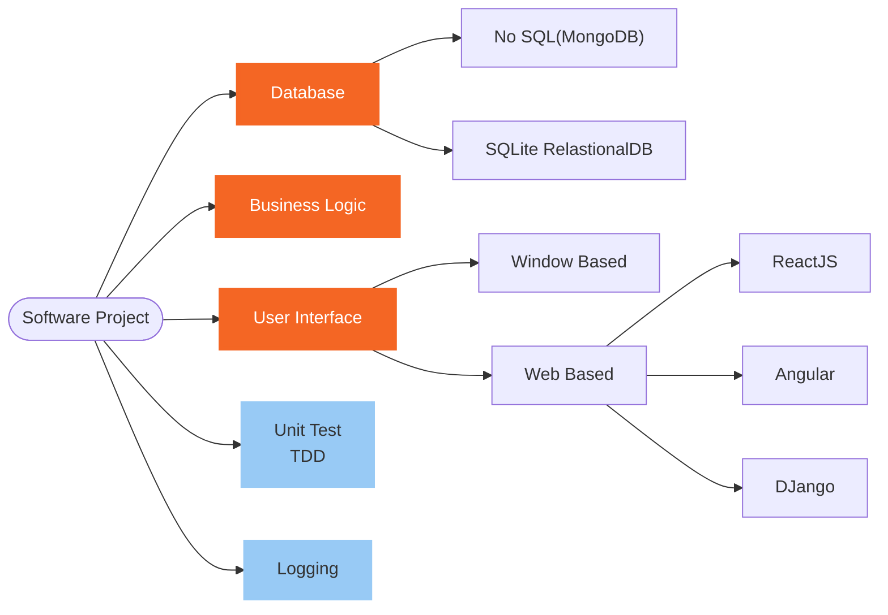
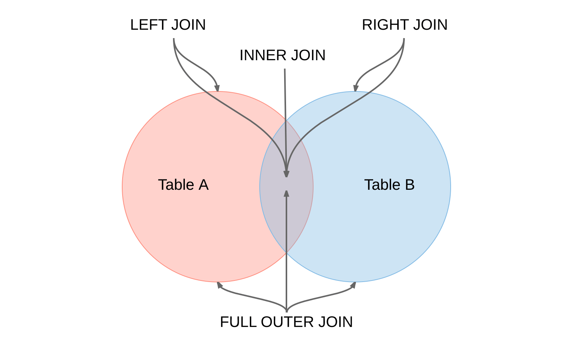

<h1> Python Language Basic </h1>

[Interesting Icons](myIcons.md)

- [My First python program](#my-first-python-program)
- [print(with variable)](#printwith-variable)
- [comment (single line, multiple line)](#comment-single-line-multiple-line)
- [Variable Naming](#variable-naming)
- [Data Type](#data-type)
- [Operator](#operator)
- [Execution Control](#execution-control)
- [Loop](#loop)
- [function](#function)
- [Unit test](#unit-test)
- [Logging](#logging)
- [SQLite](#sqlite)
  - [CRUD (Create, Retreive, Update, Delete)](#crud-create-retreive-update-delete)
  - [join](#join)
  - [left join](#left-join)
  - [right join](#right-join)
  - [full join](#full-join)
  - [self join](#self-join)
  - [Union](#union)
  - [GROUP BY](#group-by)
  - [INSERT INTO SELECT](#insert-into-select)


## My First python program
[hello.py](../src/hello.py)

## print(with variable)
[print.py](../src/print.py)
```py
print(f"The circle area with radius={r} is {a:.2f}")
```

## comment (single line, multiple line)
[comment.py](../src/languageBasics/comment.py)
* single line comment
* multiple line comment

## Variable Naming
1. variable name cannot start with number
2. variable can be combination of letters and numbers _, a~z, A~Z, 0~9, no other special characters
3. don't use reserved keywords as variable name

[Python Keywords](https://realpython.com/python-keywords/#:~:text=%20Python%20Keywords%20and%20Their%20Usage%20%201,are%20used%20for%20control%20flow%3A%20if%2C...%20More%20)
4. Avoid using existing function name as your variable name.
otherwise, your python builtins functions no longer works the way you expected.


## Data Type
* [Numbers](../src/languageBasics/number.py)
    - int
    - float
    - complex
* [String](../src/languageBasics/string.py)
    - iterale
    - slicing
    - +, *, <, > operators
    - built in functions (isdigit, isalnum, title, ...)
* [Tuple](../src/languageBasics/tuple.py)
    - iterable
    - immutable
    - slicing
    - +, * operator
* [List](../src/languageBasics/list.py)
    - iterable
    - mutable
    - slicing
    - +, * operator
    - built in functions (append, insert, remove, pop, ...)
* [Set](../src/languageBasics/set.py)
    - iterable
    - mutable
    - built in functions(add, )

* [Dict](../src/languageBasics/dictionary.py)
    - iterable: only iterate key


## Operator 
* [operator](../src/languageBasics/operator.py)
* [arithmatic](../src/languageBasics/operator/arithmatic.py)
* [assignment](../src/languageBasics/operator/assignment.py)
* [comparison](../src/languageBasics/operator/comparison.py)
* [identity](../src/languageBasics/operator/identity.py)
* [logical](../src/languageBasics/operator/logical.py)
* [membership](../src/languageBasics/operator/membership.py)
* [others](../src/languageBasics/operator/others.py)
* [ternary](../src/languageBasics/operator/ternary.py)
* [bitwise](../src/languageBasics/operator/bitwise.py)

## Execution Control
* **if-elif-else** statement Syntax
```py
if <condition>:
    # if code block here
elif <condition>:
    # elif code block here
else:
    #else code block here
# code continue ...
```
* Mermaid Diagram for if-else statement

* [if-else1.py](../src/../content/if-else/if-else1.py)
## Loop
* [simple for loop](../src/languageBasics/loop/for1.py)
* [simple while loop](../src/languageBasics/loop/while.py)
  - a while loop 


## function
    - def, Python reserved keyword
    - function name, anything you want, but need follow the naming rules
    - (), must have open/close parenthesis pair, no matter it has arguments or not
    - arguments, positional or keyword arguments separated by comma ,
    - :, must end with colon
    - the function body must indent
    - ❗️⚡️function can be overridden
    - 😄return more than one value
    - 💡single response
    - call a function by function name and (), and arguments if there is any

-  Other function uses
    - can have functions in functions 
      - [Function In Function](../src/function/functionInFunction.py)
    - passing function to function means that we can create many different functions first with the same amount of values taken in, then use their property to calculate specific values for the target function 
      - [pass function as argument](../src/function/passFunction2function.py)
    - return function can be used to return a function such as the quadratic function, and can be used to calculate specific values when plugged into these equations 
      - [return Function from function](../src/function/returnFunction.py)
$$
\underbrace {def}_{keyword} \underbrace {circle \_area}_{function \space name} \left(\underbrace {a, b,c ...}_{positional\; args} * \underbrace {e=None, f=200}_{keyword\;args}\right) \underbrace {:}_{eol}
$$

* [Function Basics](../src/function/function.py)
⚡️never override built-in functions and your previous defined function if you still need them.
* [Function in function](../src/function/functionInFunction.py)
* [Return function from function](../src/function/returnFunction.py)
* [pass function as argument](../src/function/passFunction2function.py)
  

❓What is OOP? What are differences between Functional Programming and OOP
✔️4 Features of OOP
  1. Abstraction:class is a abstraction of object in real world to python program object type.（实体模拟）
  2. Inheritance: a class can inherit from multiple other class to increase code reusability.（共性继承）
  3. Polymorphism:same function behavior differently by different object type.（异类同功）
  4. Encapsulation：avoid data or function being called outside the class unintentionally（自我保护)

* [raiseError.py](../src/function/raiseError.py)
* [assertCheck.py](../src/function/assertCheck.py)

the differenct between raise and assert:
1. assert: I swear this must bt true, help developer
2. raise: try to catch run-time error. sometime developer will use raise to control execution flow.

[a sample of using try-except to control flow](../src/function/checkFloat.py)





## Unit test
* configure unit test:
    Right-Click ⟹ Command Palette... ⟹ Configure Tests ⟹ unittest ⟹ test ⟹ test_*.py
    
## Logging
* write execution record to file. (database) used to do application analysis.
* category to different level: Debug, Info, Warning, Error, Fatal

[logging](../src/log/logging1.py)

## SQLite
[SQL Interview Website](https://www.interviewbit.com/sql-interview-questions/)
❓What is Database?
>✔️A database is an organized collection of data, stored and retrieved digitally from a remote or local computer system. Databases can be vast and complex, and such databases are developed using fixed design and modeling approaches.

❓What is DBMS?
>✔️DBMS stands for Database Management System. DBMS is a system software responsible for the creation, retrieval, updation and management of the database. It ensures that our data is consistent, organized and is easily accessible by serving as an interface between the database and its end users or application softwares.

❓What is RDBMS? How is it different from DBMS?
>✔️RDBMS stands for Relational Database Management System. The key difference here, compared to DBMS, is that RDBMS stores data in the form of a collection of tables and relations can be defined between the common fields of these tables. Most modern database management systems like MySQL, Microsoft SQL Server, Oracle, IBM DB2 and Amazon Redshift are based on RDBMS.

❓What is SQL?
>✔️SQL stands for Structured Query Language. It is the standard language for relational database management systems. It is especially useful in handling organized data comprised of entities (variables) and relations between different entities of the data.

❓What are Tables and Fields?
>✔️A table is an organized collection of data stored in the form of rows and columns. Columns can be categorized as vertical and rows as horizontal. The columns in a table are called fields while the rows can be referred to as records.

❓What are Constraints in SQL?
>✔️Constraints are used to specify the rules concerning data in the table. It can be applied for single or multiple fields in an SQL table during creation of table or after creationg using the ALTER TABLE command. The constraints are:

Constraints| Description
|---       |---         | 
NOT NULL   |Restricts NULL value from being inserted into a column.
CHECK      |Verifies that all values in a field satisfy a condition.
DEFAULT    | Automatically assigns a default value if no value has been specified for the field.
UNIQUE     |Ensures unique values to be inserted into the field.
INDEX      |Indexes a field providing faster retrieval of records.
PRIMARY KEY|Uniquely identifies each record in a table.
FOREIGN KEY|Ensures referential integrity for a record in another table.

❓What is Primary Key?
>✔️The PRIMARY KEY constraint uniquely identifies each row in a table. It must contain UNIQUE values and has an implicit NOT NULL constraint.
A table in SQL is strictly restricted to have one and only one primary key, which is comprised of single or multiple fields (columns).

* [Create, PRIMARY KEY](../src/sqlite/sqlite0.py)

❓What is UNIQUE constraint?
✔️A UNIQUE constraint ensures that all values in a column are different. This provides uniqueness for the column(s) and helps identify each row uniquely. Unlike primary key, there can be multiple unique constraints defined per table. The code syntax for UNIQUE is quite similar to that of PRIMARY KEY and can be used interchangeably.

```SQL
CREATE TABLE Students ( 	 /* Create table with a single field as unique */
    ID INT NOT NULL UNIQUE
    Name VARCHAR(255)
);

CREATE TABLE Students ( 	 /* Create table with multiple fields as unique */
    ID INT NOT NULL
    LastName VARCHAR(255)
    FirstName VARCHAR(255) NOT NULL
    CONSTRAINT PK_Student
    UNIQUE (ID, FirstName)
);

ALTER TABLE Students 	 /* Set a column as unique */
ADD UNIQUE (ID);

ALTER TABLE Students 	 /* Set multiple columns as unique */
ADD CONSTRAINT PK_Student 	 /* Naming a unique constraint */
UNIQUE (ID, FirstName);
```

❓What is a Foreign Key?
✔️A FOREIGN KEY comprises of single or collection of fields in a table that essentially refer to the PRIMARY KEY in another table. Foreign key constraint ensures referential integrity in the relation between two tables.
The table with the foreign key constraint is labelled as the child table, and the table containing the candidate key is labelled as the referenced or parent table.

```sql
CREATE TABLE Supplier (
  SupplierNumber INTEGER NOT NULL,
  Name           VARCHAR(20) NOT NULL,
  Address        VARCHAR(50) NOT NULL,
  CONSTRAINT supplier_pk PRIMARY KEY(SupplierNumber),
  CONSTRAINT number_value CHECK(SupplierNumber > 0)
)

CREATE TABLE Invoice (
  InvoiceNumber  INTEGER NOT NULL,
  Text           VARCHAR(4096),
  SupplierNumber INTEGER NOT NULL,
  CONSTRAINT invoice_pk PRIMARY KEY(InvoiceNumber),
  CONSTRAINT inumber_value CHECK (InvoiceNumber > 0),
  CONSTRAINT supplier_fk
    FOREIGN KEY(SupplierNumber) REFERENCES Supplier(SupplierNumber)
    ON UPDATE CASCADE ON DELETE RESTRICT
)
```


❓What is an Index? Explain its different types
✔️A database index is a data structure that provides quick lookup of data in a column or columns of a table. It enhances the speed of operations accessing data from a database table at the cost of additional writes and memory to maintain the index data structure.

* Unique and Non-Unique Index:
>Unique indexes are indexes that help maintain data integrity by ensuring that no two rows of data in a table have identical key values. Once a unique index has been defined for a table, uniqueness is enforced whenever keys are added or changed within the index.

* Clustered and Non-Clustered Index:
>Clustered indexes are indexes whose order of the rows in the database correspond to the order of the rows in the index. This is why only one clustered index can exist in a given table, whereas, multiple non-clustered indexes can exist in the table.

❓What is the difference between Clustered and Non-clustered index?
>✔️ the differences can be broken down into three small factors 
1. Clustered index modifies the way records are stored in a database based on the indexed column. Non-clustered index creates a separate entity within the table which references the original table.
2. Clustered index is used for easy and speedy retrieval of data from the database, whereas, fetching records from the non-clustered index is relatively slower.
3. In SQL, a table can have a single clustered index whereas it can have multiple non-clustered indexes.

❓What is a Query?
✔️A query is a request for data or information from a database table or combination of tables. 
1. select query or 
2. an action query.

❓What is a Subquery? What are its types?
✔️A subquery is a query within another query, also known as nested query or inner query .
1. A **correlated subquery** cannot be considered as an independent query, but it can refer the column in a table listed in the FROM of the main query.
2. A non-correlated subquery can be considered as an independent query and the output of subquery is substituted in the main query.

❓What are some common clauses used with SELECT query in SQL?
✔️Some common SQL clauses used in conjuction with a SELECT query are as follows:
1. WHERE clause in SQL is used to filter records that are necessary, based on specific conditions.
2. ORDER BY clause in SQL is used to sort the records based on some field(s) in ascending (ASC) or descending order (DESC).
3. GROUP BY clause in SQL is used to group records with identical data and can be used in conjuction with some aggregation functions to produce summarized results from the database.
4. HAVING clause in SQL is used to filter records in combination with the GROUP BY clause. It is different from WHERE, since WHERE clause cannot filter aggregated records

❓What is Cursor? How to use a Cursor?
✔️A database cursor is a control structure that allows for traversal of records in a database.
```sql
DECLARE @name VARCHAR(50) 	 /* Declare All Required Variables */

DECLARE db_cursor CURSOR FOR 	 /* Declare Cursor Name*/
SELECT name
FROM myDB.students
WHERE parent_name IN ('Sara', 'Ansh')

OPEN db_cursor 	 /* Open cursor and Fetch data into @name */ 
FETCH next
FROM db_cursor
INTO @name

CLOSE db_cursor 	 /* Close the cursor and deallocate the resources */
DEALLOCATE db_cursor
```

❓What are Entities and Relationships?
✔️**Entity:** An entity can be a real-world object, either tangible or intangible, that can be easily identifiable. For example, in a college database, students, professors, workers, departments, and projects can be referred to as entities. Each entity has some associated properties that provide it an identity.
✔️**Relationship:** Relations or links between entities that have something to do with each other. For example - The employees table in a company's database can be associated with the salary table in the same database.
* one-to-many & Many-to-one
* Many-to-Many
* Self Referencing Relationship: This is used when a table needs to define a relationship with itself.

❓What is a View?
✔️A view in SQL is a virtual table based on the result-set of an SQL statement. A view contains rows and columns, just like a real table. The fields in a view are fields from one or more real tables in the database.

❓What is Normalization?
✔️Normalization represents the way of organizing structured data in the database efficiently. It includes creation of tables, establishing relationships between them, and defining rules for those relationships. Inconsistency and redundancy can be kept in check based on these rules, hence, adding flexibility to the database.

❓What is Denormalization?
✔️Denormalization is the inverse process of normalization, where the normalized schema is converted into a schema which has redundant information. The performance is improved by using redundancy and keeping the redundant data consistent. The reason for performing denormalization is the overheads produced in query processor by an over-normalized structure.

❓What are the TRUNCATE, DELETE and DROP statements?
✔️

❓What is PL/SQL Stored Procedure?
✔️A stored procedure is a set of Structured Query Language (SQL) statements with an assigned name, which are stored in a relational database management system (RDBMS) as a group, so it can be reused and shared by multiple programs.

```sql
CREATE OR REPLACE procedure_name(arg1 data_type, ...) AS
BEGIN
  ....
END procedure_name;

CREATE OR REPLACE procedure_name(arg1 data_type, ...) AS
BEGIN
  ....
END procedure_name;
```

❓What is function
✔️
```sql
CREATE OR REPLACE
FUNCTION calculate_score
( cat IN VARCHAR2
, score IN NUMBER
, weight IN NUMBER
) RETURN NUMBER AS
BEGIN
  RETURN NULL;
END calculate_score;
```

### CRUD (Create, Retreive, Update, Delete)
* Create (Insert into)
  [sqlite insert](../src/sqlite/sqlite1.py)

* Retreive (Select * from ... where ...)
  [sqlite select](../src/sqlite/sqlite2.py)

* Update 
  [sqlite update](../src/sqlite/sqlite4.py)

* Delete
  [sqlite delete](../src/sqlite/sqlite5.py)

### join
❓What is a Join? List its different types
✔️



 **(inner) join**: Retrieves records that have matching values in both tables involved in the join. This is the widely used join for queries.


```sql
SELECT *
FROM Table_A
JOIN Table_B;

SELECT *
FROM Table_A
INNER JOIN Table_B;

SELECT column_name(s)
FROM table1
INNER JOIN table2
ON table1.column_name = table2.column_name;
```
[Customers and Orders](../src/sqlite/customer.py)

```sql
SELECT Orders.OrderID, Customers.CustomerName
FROM Orders
INNER JOIN Customers ON Orders.CustomerID = Customers.CustomerID;
```

```output
10308	Ana Trujillo
```

### left join
 **LEFT (OUTER) JOIN:** Retrieves all the records/rows from the left and the matched records/rows from the right table.

```sql
SELECT *
FROM Table_A A
LEFT JOIN Table_B B
ON A.col = B.col;
```


[Customers and Orders](../src/sqlite/customer.py)

```sql
SELECT Customers.CustomerName, Orders.OrderID
FROM Customers
LEFT JOIN Orders ON Customers.CustomerID = Orders.CustomerID
ORDER BY Customers.CustomerName;
```
CustomerName | OrderID
|---|---|
Alfreds Futterkiste|NULL	
Ana Trujillo	   |10308
Antonio Moreno	   |NULL

### right join
 **RIGHT (OUTER) JOIN:** Retrieves all the records/rows from the right and the matched records/rows from the left table.

```sql
SELECT *
FROM Table_A A
RIGHT JOIN Table_B B
ON A.col = B.col;
```


[Customers and Orders](../src/sqlite/employee.py)

```sql
SELECT Orders.OrderID, Employees.LastName, Employees.FirstName
FROM Orders
RIGHT JOIN Employees ON Orders.EmployeeID = Employees.EmployeeID
ORDER BY Orders.OrderID;
```
❌😢RIGHT and FULL OUTER JOINs are not currently supported
```output
Execution finished with errors.
Result: RIGHT and FULL OUTER JOINs are not currently supported
At line 1:
SELECT Orders.OrderID, Employees.LastName, Employees.FirstName
FROM Orders
RIGHT JOIN Employees
```

### full join
 **FULL (OUTER) JOIN:** Retrieves all the records where there is a match in either the left or right table.


### self join
* **Self Join** Syntax
  
```sql
SELECT column_name(s)
FROM table1 T1, table1 T2
WHERE condition;
```
[Customers and Orders](../src/sqlite/customer.py)

👇The following SQL statement matches customers that are from the same city:

```sql
SELECT A.CustomerName AS CustomerName1, B.CustomerName AS CustomerName2, A.City
FROM Customers A, Customers B
WHERE A.CustomerID <> B.CustomerID
AND A.City = B.City
```

CustomerName1 | CustomerName2 | City
|---          |---            |---       |
Alfreds Futterkiste	|Antonio Moreno	     |Berlin
Antonio Moreno	    |Alfreds Futterkiste |Berlin

### Union

```sql
SELECT column_name(s) FROM table1
UNION ALL
SELECT column_name(s) FROM table2;
```
[supplier.py](../src/sqlite/supplier.py)

```sql
SELECT City FROM Customers
UNION
SELECT City FROM Suppliers
ORDER BY City;
```
```output
Ann Arbor
Berlin
London
Mexico D.F.
New Orleans
```

### GROUP BY

```sql
SELECT column_name(s)
FROM table_name
WHERE condition
GROUP BY column_name(s)
ORDER BY column_name(s);
```
[Customers and Orders](../src/sqlite/customer.py)

```sql
SELECT COUNT(CustomerID), Country
FROM Customers
GROUP BY Country
ORDER BY COUNT(CustomerID) DESC;
```

```output
2	Mexico
1	UK
1	Sweden
1	Germany
```

### INSERT INTO SELECT

* Copy all columns from one table to another table:

```sql
INSERT INTO table2
SELECT * FROM table1
WHERE condition;
```

* Copy only some columns from one table into another table:

```sql
INSERT INTO table2 (column1, column2, column3, ...)
SELECT column1, column2, column3, ...
FROM table1
WHERE condition;
```


