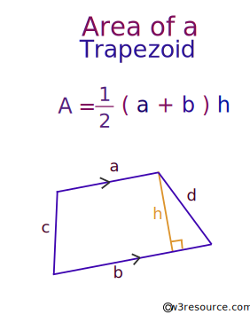

* define a function which calculate trapezoid area by given upper-side, down-side and height.



Expected output

```
Enter upper side: 3
Enter down side: 5
Enter hight: 4

The trapezoid area is 16.
```
